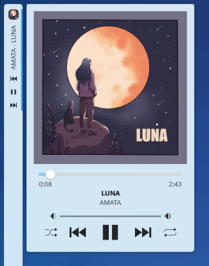
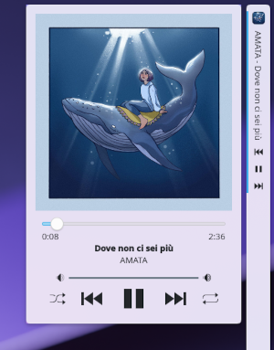

<div align="center">

# PlasMusic Toolbar

[&color=1f425f&labelColor=2d333b&logo=kde&label=KDE%20Store)](https://store.kde.org/p/2128143)


PlasMusic Toolbar is a widget for KDE Plasma 6 that shows currently playing song information and provide playback controls. (A Plasma 5 version of the widget is available in the [plasma5 branch](https://github.com/ccatterina/plasmusic-toolbar/tree/plasma5).)

</div>

## Features

### 🎵 Now Playing Song
- Show the currently playing song's title and artist in the KDE panel

### ⏯️ Playback Controls
- Manage your music effortlessly with Play, Pause, Next, and Previous controls directly from the KDE panel.

### 📸 Full View
- Full View provides the album image, along with Play, Pause, Next, Previous, Shuffle, and Repeat controls. Adjust the volume and track position with ease.

### 🖥️ Compatibility
- Compatible with both vertical and horizontal KDE Plasma panels, can also be used as a desktop widget.

### 🛠️ Configurations
- **Icon customization:** Change the widget's icon in the panel view to suit your preferences. You can also choose to display the album cover.
- **Font customization:** Change the widget's text font to suit your preferences.
- **Panel song/icon/controls visibility:** Choose whether to show icon, song text and playback controls in the panel view.
- **Preferred source**: Change the widget preferred source for music information (choose between active MPRIS2 sources).
- **Song text customization**: Customize the maximum (or fixed) text width and scrolling behavior with adjustable scroll speed.
- and more...


## Installation

### KDE store

You can install the widget directly from the kde store:

- https://store.kde.org/p/2128143


### Manual
1. Clone the repository:
    ```sh
    git clone https://github.com/ccatterina/plasmusic-toolbar.git /tmp/plasmusic-toolbar
    ```

2. Install the widget:

    ```sh
    kpackagetool6 -i /tmp/plasmusic-toolbar/src/ --type Plasma/Applet
    ```

3. Upgrading the widget:

    ```sh
    kpackagetool6 -u /tmp/plasmusic-toolbar/src/ --type Plasma/Applet
    ```

4. Removing the widget:

    ```sh
    kpackagetool6 -r plasmusic-toolbar --type Plasma/Applet
    ```


### Unofficial packages

#### AUR package

⚠️ **Unofficial package** Use at your own risk – I cannot guarantee security.

Maintainer: [@D3SOX](https://www.github.com/D3SOX)

For those using an Arch-based distribution, an AUR package is available:
 - https://aur.archlinux.org/packages/plasma6-applets-plasmusic-toolbar


#### Nix package

⚠️ **Unofficial package** Use at your own risk – I cannot guarantee security.

Maintainer: [@HeitorAugustoLN](https://github.com/HeitorAugustoLN)

For those using NixOS or the nix package manager, a Nix package is available in nixpkgs-unstable.

To install the widget use one of these methods:

- NixOS

  ```nix
  environment.systemPackages = with pkgs; [
    plasmusic-toolbar
  ];
  ```

- [Home-manager](https://github.com/nix-community/home-manager)

  ```nix
  home.packages = with pkgs; [
    plasmusic-toolbar
  ];
  ```

- [Plasma-manager](https://github.com/nix-community/plasma-manager): If the widget gets added to a panel it will automatically be installed

- Other distros using nix package manager

  ```
  # without flakes:
  nix-env -iA nixpkgs.plasmusic-toolbar
  # with flakes:
  nix profile install nixpkgs#plasmusic-toolbar
  ```


## Translations

### Prerequisites

Make sure you have the package `gettext` installed on your system, as it is required for managing translations.

### I18n helper script

The widget comes with a helper script (`bin/i18n`) to manage translations:

1. **Extract translatable strings** from the source code:
   ```sh
   ./bin/i18n extract
   ```
   Creates/updates the translation template file (`src/translate/template.pot`) and updates existing `.po` files.

1. **Check translation status**:
   ```sh
   ./bin/i18n check
   ```
   Check if translations template is up to date and shows how many strings are untranslated in each language file.

1. **Initialize a new language**:
   ```sh
   ./bin/i18n init <lang_code>
   ```
   For example, `./bin/i18n init fr` creates a new French translation file.

1. **Compile translations**:
   ```sh
   ./bin/i18n compile
   ```
   This compiles all `.po` files into `.mo` files that the widget can use.

### Contributing Translations

1. Create or edit a `.po` file in the `src/translate/` directory.
1. Compile the translations to verify they work correctly.
1. Submit a pull request with your changes to the `src/translate/` directory, do not include the compiled `.mo` files, as they will be generated automatically during the build process.


## Screenshots

<p align="center">
  
  
  <br>
  
  
  <br>
  
  
<p>

