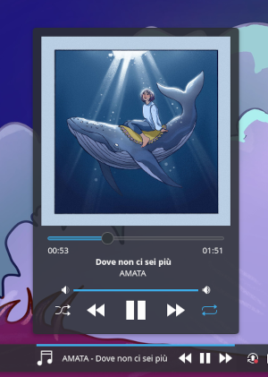
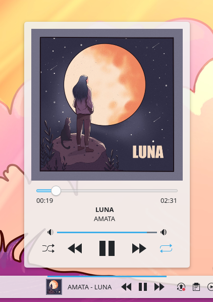

# PlasMusic Toolbar

[](https://aur.archlinux.org/packages/plasma6-applets-plasmusic-toolbar)

## Overview

PlasMusic Toolbar is a widget for KDE Plasma 6 that shows currently playing song information and provide playback controls.

A Plasma 5 version of the widget is available in the [plasma5 branch](https://github.com/ccatterina/plasmusic-toolbar/tree/plasma5).

## Features

### 🎵 Now Playing Song
- Show the currently playing song's title and artist in the KDE panel

### ⏯️ Playback Controls
- Manage your music effortlessly with Play, Pause, Next, and Previous controls directly from the KDE panel.

### 📸 Full View
- Full View provides the album image, along with Play, Pause, Next, Previous, Shuffle, and Repeat controls. Adjust the volume and track position with ease.

### 🛠️ Configurations
- **Icon customization:** Change the widget's icon in the panel view to suit your preferences. You can also choose to display the album cover.
- **Playback controls visibility:** Choose whether to display Play, Pause, Next, and Previous controls in the panel view.
- **Preferred source**: Change the widget preferred source for music information (spotify, vlc, etc). The name of the source is the same as the desktop file name of the application (see `/usr/share/applications/`).
- **Playing song max display width**: Determine the maximum width for displaying the currently playing song in the panel. When the song's text exceeds this maximum width, the text will scroll horizontally.
- **Playing song scrolling speed**: Change the scrolling speed of the song's text.
- and more...

## Installation

### KDE store

You can install the widget directly from the kde store:

- https://store.kde.org/p/2128143

### AUR package

For those using an Arch-based distribution, an AUR package is available:
 - https://aur.archlinux.org/packages/plasma6-applets-plasmusic-toolbar

Thanks to [@D3SOX](https://www.github.com/D3SOX) for creating and maintaining the package! 

### Manual
1. Clone the repository:
    ```sh
    git clone git@github.com:ccatterina/plasmusic-toolbar.git /tmp/plasmusic-toolbar
    ```

2. Install the widget:

    ```sh
    kpackagetool6 -i /tmp/plasmusic-toolbar/src/ --type Plasma/Applet
    ```

3. Upgrading the widget:

    ```sh
    kpackagetool6 -u /tmp/plasmusic-toolbar/src/ --type Plasma/Applet
    ```

4. Removing the widget:

    ```sh
    kpackagetool6 -r plasmusic-toolbar --type Plasma/Applet
    ```

## Screenshots

<p align="center">
  
</p>
