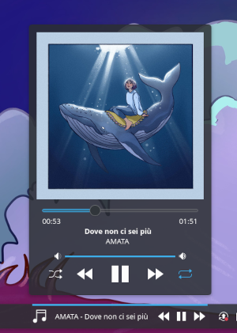
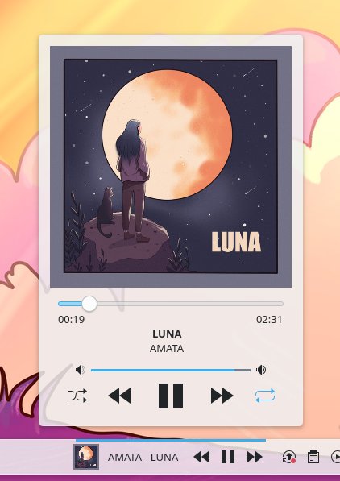
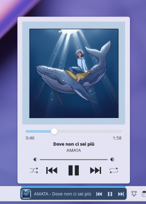
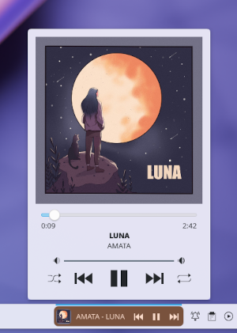
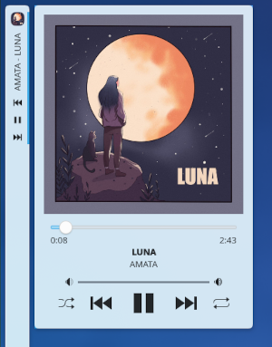
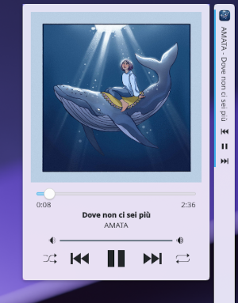

<div align="center">

# PlasMusic Toolbar

[&color=1f425f&labelColor=2d333b&logo=kde&label=KDE%20Store)](https://store.kde.org/p/2128143)


PlasMusic Toolbar is a KDE Plasma widget that shows the current playback information and provides basic playback controls.

</div>

## 🧩 Compatibility

- Compatible with KDE Plasma 6.0.4 and newer.
- Last compatible release for older Plasma 6 versions: [**v3.7.0**](https://github.com/ccatterina/plasmusic-toolbar/tree/v3.7.0)
- Plasma 5: a Plasma 5 version of the widget is available in the `plasma5` branch: https://github.com/ccatterina/plasmusic-toolbar/tree/plasma5


## ✨ Features

- **🎵 Now Playing** — Title, artist and album art shown right in the KDE panel.
- **⏯️ Playback Controls** — Play, pause, skip and go back without leaving the panel.
- **📸 Full View** — Popup with album art, full playback controls (shuffle, repeat included), volume and seek bar.
- **🔀 Preferred Source** — Choose which media player the widget should follow.
- **🖥️ Flexible Layout** — Works in horizontal and vertical panels, and as a desktop widget.
- **🎨 Deep Customization** — Icon, album cover, fonts, panel visibility of icon/text/controls, scrolling text behavior, and more.

All media info (title, artist, cover art url, playback state) is read from your media player via **[MPRIS2](https://specifications.freedesktop.org/mpris-spec/latest/)**. The same interface is used to send playback and other commands back to the player.


## 📦 Installation

### KDE store

You can install the widget directly from the kde store:

- https://store.kde.org/p/2128143


### Manual
1. Clone the repository:
    ```sh
    git clone https://github.com/ccatterina/plasmusic-toolbar.git /tmp/plasmusic-toolbar
    ```

2. Install the widget:

    ```sh
    kpackagetool6 -i /tmp/plasmusic-toolbar/src/ --type Plasma/Applet
    ```

3. Upgrading the widget:

    ```sh
    kpackagetool6 -u /tmp/plasmusic-toolbar/src/ --type Plasma/Applet
    ```

4. Removing the widget:

    ```sh
    kpackagetool6 -r plasmusic-toolbar --type Plasma/Applet
    ```


### Unofficial packages

#### AUR package

⚠️ **Unofficial package** — Use at your own risk.

**Maintainer**: [@D3SOX](https://www.github.com/D3SOX)

For those using an Arch-based distribution, an AUR package is available:
 - https://aur.archlinux.org/packages/plasma6-applets-plasmusic-toolbar


#### Nix package

⚠️ **Unofficial package** — Use at your own risk.

**Maintainer**: [@HeitorAugustoLN](https://github.com/HeitorAugustoLN)

For those using NixOS or the nix package manager, a Nix package is available in nixpkgs.

To install the widget use one of these methods:

- NixOS

  ```nix
  environment.systemPackages = with pkgs; [
    plasmusic-toolbar
  ];
  ```

- [Home-manager](https://github.com/nix-community/home-manager)

  ```nix
  home.packages = with pkgs; [
    plasmusic-toolbar
  ];
  ```

- [Plasma-manager](https://github.com/nix-community/plasma-manager): If the widget gets added to a panel it will automatically be installed

- Other distros using nix package manager

  ```
  # without flakes:
  nix-env -iA nixpkgs.plasmusic-toolbar
  # with flakes:
  nix profile install nixpkgs#plasmusic-toolbar
  ```


## 🌍 Translations

Want to help translate PlasMusic Toolbar into your language? See [TRANSLATIONS.md](TRANSLATIONS.md) for instructions.

## 🖼️ Screenshots

<p align="center">
  
  
  <br>
  
  
  <br>
  
  
</p>
